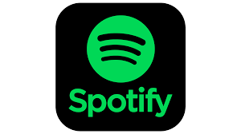

# 🎵 Billboard Hot 100 Spotify Playlist Creator
[Introduction](#introduction_h) | [Functionality](#functionality_h) | [Technologies](#technologies_h) | [Setup and Usage](#setup_usage_h) | [Acknowledgements](#acknowledge_h) | [License](#license_h)

Create Spotify playlists based on Billboard Hot 100 charts for any given date.
 

<h2>Introduction</h2>

This project aims to automate the creation of Spotify playlists based on Billboard's Hot 100 chart for a specified date. It is designed for music enthusiasts who want to revisit popular music from a specific time period. The script fetches song data from the Billboard Hot 100 and then searches for these tracks on Spotify, creating a nostalgic playlist for the user.
 

<h2>Functionality</h2>

The program works by first asking the user for a target date. It then scrapes the Billboard Hot 100 chart for that date to get the list of top songs. Using Spotify's API, it searches for these songs and creates a new Spotify playlist, adding the found tracks to this playlist. The script also handles various edge cases and errors, such as invalid date formats and missing songs on Spotify.
 

<h2>Technologies</h2>

 

<h2>Setup and Usage</h2>

To use this script, you need to have Python installed on your machine along with the BeautifulSoup, Spotipy, and Requests libraries. You also need to set up a Spotify Developer account and create an app to obtain your client ID and client secret. These credentials should be set as environment variables. Detailed instructions on setup and usage can be found in the accompanying documentation.
 

<h2>Acknowledgements</h2>

Special thanks to the Billboard for maintaining an extensive database of music charts and to Spotify for providing an accessible API for music data and playlist management.

<h2>License</h2>

Licensed under MIT License.

